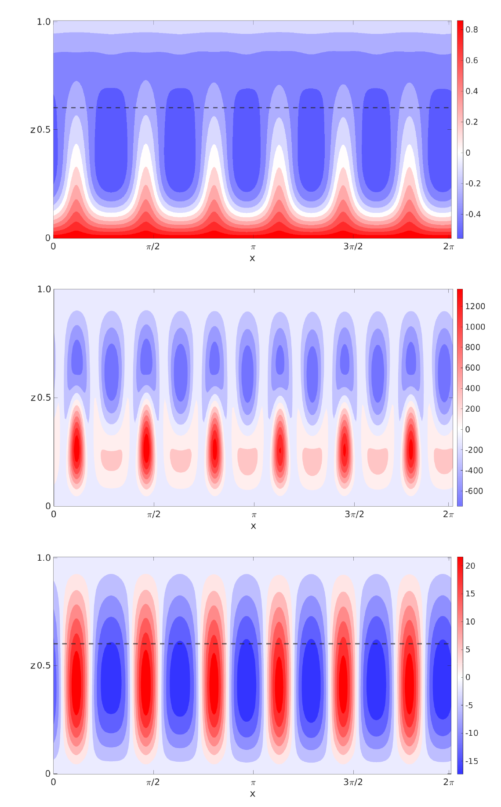

# The little fluid that lives in your browser

<p class="stir-hint">Move the pointer anywhere to push the fluid. The panel in the top right changes how it behaves and how it is drawn, all while it runs.</p>

## The state of a fluid is a field, not a crowd

The first mental shift is to stop thinking about molecules. A fluid, for our purposes, is described entirely by a **velocity field**: a function that assigns a velocity vector to every point in space and every instant in time,

$$ \mathbf{u}(\mathbf{x}, t) : \mathbb{R}^2 \times \mathbb{R} \to \mathbb{R}^2 . $$

Picture an arrow planted at every point, each saying which way the fluid there is moving and how fast. That field *is* the fluid. If I know every arrow now, and I know the law that tells the arrows how to change, I can advance time by a small step $\Delta t$ and draw the next instant. Repeat, and the fluid comes alive.

So the whole task reduces to two questions. What law governs $\mathbf{u}$, and how do I evaluate the next instant fast enough that it keeps pace with your hand?

## The governing law: incompressible Navier–Stokes

The law is the incompressible Navier–Stokes system. It is really two equations working together. The first is Newton's second law written for a little parcel of fluid,

$$ \frac{\partial \mathbf{u}}{\partial t} = -(\mathbf{u}\cdot\nabla)\,\mathbf{u} \;-\; \frac{1}{\rho}\nabla p \;+\; \nu\,\nabla^{2}\mathbf{u} \;+\; \mathbf{f}, $$

and the second is a constraint that must hold at all times,

$$ \nabla \cdot \mathbf{u} = 0 . $$

It looks like a lot, so let me read the momentum equation term by term. Each one has a clean physical meaning.

- $-(\mathbf{u}\cdot\nabla)\mathbf{u}$ is **advection**: the fluid carries its own velocity along with it. This nonlinear term is the source of essentially all of the interesting behaviour, the swirls and the turbulence.
- $-\tfrac{1}{\rho}\nabla p$ is the **pressure gradient**: fluid is pushed from regions of high pressure toward low pressure.
- $\nu\,\nabla^{2}\mathbf{u}$ is **viscous diffusion**: internal friction of strength $\nu$ that smooths neighbouring velocities toward agreement.
- $\mathbf{f}$ is any **external force** per unit mass, which in this simulation is you, dragging the pointer.

The second equation, $\nabla\cdot\mathbf{u}=0$, is the quiet one, and it is where all the personality comes from. In words: as much fluid flows into any tiny region as flows out of it. Nothing is allowed to pile up or vanish. This single constraint is what makes water behave like water instead of like a puff of smoke thinning into nothing, and, as we will see, it is by far the hardest part of the system to keep true, because every other step keeps quietly violating it.

## Operator splitting: solve one term at a time

Trying to satisfy the whole momentum equation and the incompressibility constraint in one monolithic update is miserable. The idea that made real-time fluids practical, due to Jos Stam, is almost lazy: over one time step, apply each term on its own, in sequence, feeding the output of one substep into the next.

So each frame the velocity field runs through a short pipeline,

$$ \mathbf{u} \;\xrightarrow{\text{advect}}\; \mathbf{w}_1 \;\xrightarrow{\text{project}}\; \mathbf{w}_2 \;\xrightarrow{\text{damp}}\; \mathbf{u}_{\text{next}} , $$

with your pointer's push injected straight into the field wherever the mouse happens to be moving, in between frames. Each arrow handles one job. Advection is the self-transport term; **projection** is the compound step that restores $\nabla\cdot\mathbf{u}=0$ and cleans up the divergence the other operations leave behind; damping stands in for viscosity. Two simplifications here are standard for interactive fluids and worth naming honestly: I replace the full viscous diffusion solve with a cheap uniform decay, and I inject the external force as a localised impulse under the pointer rather than as a smooth body force. Everything else is solved properly.

The rest of this article walks the interesting arrows one at a time.

## Advection by tracing characteristics

Advection is the term $-(\mathbf{u}\cdot\nabla)\mathbf{u}$: the field transporting itself. The naive approach is to push each parcel *forward* to where its velocity points. That is an explicit scheme, and it blows up the moment the flow gets lively, because a parcel can overshoot its cell in a single step.

Stam's trick is to run time backwards instead. A quantity that is simply carried by the flow is constant along a **characteristic**, the path a parcel traces. So to find the value that has just arrived at a grid point $\mathbf{x}$, I ask where that parcel *was* one step ago, and copy the value from there:

$$ \mathbf{u}(\mathbf{x},\, t+\Delta t) \;=\; \mathbf{u}\!\left(\mathbf{x} - \mathbf{u}(\mathbf{x},t)\,\Delta t,\; t\right) . $$

This is the semi-Lagrangian method. Because I only ever *read* from a location that already exists and interpolate there, the result can never grow larger than what was already present. The scheme is unconditionally stable: it will not explode no matter how big the step or how fast the flow. On the GPU it is almost embarrassingly short. Trace back, then look up:

```glsl
// advection: sample the velocity field at the point the flow came from
in vec2 v_uv;
uniform sampler2D u_state;      // the field being carried (here: velocity)
uniform sampler2D u_velocity;   // the velocity doing the carrying
uniform vec2 u_dimensions;
out vec2 out_state;

void main() {
    vec2 back = v_uv - texture(u_velocity, v_uv).xy / u_dimensions;
    out_state = texture(u_state, back).xy;
}
```

The bilinear texture lookup does the interpolation for free, which is exactly why storing the fluid in GPU textures pays off.

## Projection: the pressure is whatever it must be

After advecting and adding your force, the field $\mathbf{w}$ almost certainly has nonzero divergence: it has fountains and drains where fluid is being created or destroyed. Projection is the step that removes them, and it rests on one beautiful piece of vector calculus, the **Helmholtz–Hodge decomposition**. Any smooth vector field splits uniquely into a divergence-free part and the gradient of a scalar:

$$ \mathbf{w} \;=\; \mathbf{u} \;+\; \nabla p, \qquad \nabla\cdot\mathbf{u}=0 . $$

The divergence-free part $\mathbf{u}$ is the physical flow I want to keep. The leftover $\nabla p$ is precisely the part that violates the constraint, and $p$ turns out to be the pressure. To find $p$, take the divergence of both sides. The divergence of $\mathbf{u}$ vanishes by definition, leaving a **Poisson equation** for the pressure:

$$ \nabla\cdot\mathbf{w} \;=\; \nabla\cdot(\nabla p) \;=\; \nabla^{2} p . $$

This is the aha moment for me. The pressure is not something I have to model separately; it is simply *defined* as whatever scalar field has exactly the divergence I need to subtract off. Solve

$$ \nabla^{2} p = \nabla\cdot\mathbf{w}, $$

then set

$$ \mathbf{u} = \mathbf{w} - \nabla p, $$

and the flow is clean again. Computing the divergence on the right is a single central difference:

```glsl
// divergence of the velocity field: 0.5 * (du/dx + dv/dy) on a unit grid
float n = texture(u_vectorField, v_uv + vec2(0.0, u_pxSize.y)).y;
float s = texture(u_vectorField, v_uv - vec2(0.0, u_pxSize.y)).y;
float e = texture(u_vectorField, v_uv + vec2(u_pxSize.x, 0.0)).x;
float w = texture(u_vectorField, v_uv - vec2(u_pxSize.x, 0.0)).x;
out_divergence = 0.5 * (e - w + n - s);
```

## Solving the pressure equation by letting the cells argue

The Poisson equation $\nabla^{2}p=b$ (with $b=\nabla\cdot\mathbf{w}$) couples every cell to its neighbours, and their neighbours to theirs, so there is no way to solve it in one shot. But it *is* easy to solve iteratively. Discretise the Laplacian with the standard five-point stencil on a grid of unit spacing:

$$ \nabla^{2}p_{i,j} \;\approx\; p_{i+1,j} + p_{i-1,j} + p_{i,j+1} + p_{i,j-1} - 4\,p_{i,j} . $$

Setting this equal to $b_{i,j}$ and solving for the centre value gives the **Jacobi update**: sweep the whole grid over and over, each time replacing every cell with

$$ p_{i,j}^{(k+1)} \;=\; \frac{p_{i+1,j}^{(k)} + p_{i-1,j}^{(k)} + p_{i,j+1}^{(k)} + p_{i,j-1}^{(k)} \;-\; b_{i,j}}{4} . $$

Written in the general form $p' = (p_n + p_s + p_e + p_w + \alpha\,b)\,\beta$ used in the shader, this is exactly $\alpha=-1$ and $\beta=\tfrac14$: the $-1$ is the unit grid spacing squared carried onto the right-hand side, and the $\tfrac14$ is the reciprocal of the $4$ on the stencil's diagonal.

```glsl
// one Jacobi sweep of the pressure Poisson equation
vec4 n = texture(u_previousState, v_uv + vec2(0.0, u_pxSize.y));
vec4 s = texture(u_previousState, v_uv - vec2(0.0, u_pxSize.y));
vec4 e = texture(u_previousState, v_uv + vec2(u_pxSize.x, 0.0));
vec4 w = texture(u_previousState, v_uv - vec2(u_pxSize.x, 0.0));
vec4 d = texture(u_divergence, v_uv);
out_jacobi = (n + s + e + w + u_alpha * d) * u_beta;   // alpha = -1, beta = 1/4
```

Each sweep carries information one cell further, so more iterations means a more globally consistent pressure and a stiffer, more water-like fluid. Fewer iterations leave the pressure only locally correct, and the flow looks loose and gassy. It is a direct dial between speed and accuracy, and it is the **Jacobi iterations** knob in the panel. Once $p$ has settled, one more central difference subtracts its gradient:

```glsl
// gradient subtraction: u = w - grad(p)
float pn = texture(u_scalarField, v_uv + vec2(0.0, u_pxSize.y)).r;
float ps = texture(u_scalarField, v_uv - vec2(0.0, u_pxSize.y)).r;
float pe = texture(u_scalarField, v_uv + vec2(u_pxSize.x, 0.0)).r;
float pw = texture(u_scalarField, v_uv - vec2(u_pxSize.x, 0.0)).r;
out_result = texture(u_vectorField, v_uv).xy - 0.5 * vec2(pe - pw, pn - ps);
```

## A little damping to keep it honest

Real viscosity would be a second diffusion solve, another Poisson-style system to iterate. For an interactive toy I approximate it with a single cheap pass right after projection: multiply every velocity by a factor $\gamma$ just below $1$, then clamp the magnitude so a stray fast texel can never blow up the low-iteration pressure solve,

$$ \mathbf{u} \;\leftarrow\; \min\!\left(\gamma\,|\mathbf{u}|,\; v_{\max}\right)\,\hat{\mathbf{u}} . $$

The whole step is four lines of shader:

```glsl
// damping: uniform decay, then a hard speed limit
vec2 vel = texture(u_velocity, v_uv).xy * u_decay;   // u_decay = gamma, e.g. 0.98
float mag = length(vel);
if (mag > u_maxVelocity) vel = vel / mag * u_maxVelocity;
out_velocity = vel;
```

This is why the fluid gradually comes to rest if you stop stirring it, and why nudging the **viscosity** slider toward $1$ ($\gamma\to1$, no decay) lets a single swirl persist for a very long time.

## Making the invisible visible

The velocity field itself is invisible, so I need something to ride along and reveal it. I scatter a large cloud of weightless tracer particles uniformly across the screen and simply let the flow carry each one. To move a particle accurately I do not take a blind Euler step; I use the **midpoint method** (a second-order Runge–Kutta scheme): sample the velocity where the particle is, step half a substep to a trial midpoint, sample the velocity *there*, and use that better estimate for the full move,

$$ \mathbf{x}_{k+1} \;=\; \mathbf{x}_k \;+\; \Delta\tau\,\mathbf{u}\!\left(\mathbf{x}_k + \tfrac{\Delta\tau}{2}\,\mathbf{u}(\mathbf{x}_k)\right), \qquad \Delta\tau = \frac{1}{k_{\text{sub}}} .$$

```glsl
// advect one particle with a midpoint (RK2) step through the velocity field
vec2 position  = absolute + displacement;
vec2 pxSize    = 1.0 / u_dimensions;
vec2 velocity1 = texture(u_velocity, position * pxSize).xy;
vec2 halfStep  = position + velocity1 * 0.5 * dTau;
vec2 velocity2 = texture(u_velocity, halfStep * pxSize).xy;
displacement  += velocity2 * dTau;
```

Each particle carries an age. It fades in when it is born, fades out as it nears its lifetime, and is then quietly recycled to a fresh starting point, so the picture never clogs up or drains empty. Every frame I draw the particles into a trail buffer that decays by $-1/\text{trailLength}$ per frame, so each speck leaves a short comet tail whose length is exactly the **Trail Length** knob. Those fading streaks are what you see, and each one is a single tracer reporting the current it is caught in.

There are four ways to watch the same fluid, switched live from the **Render Mode** menu:

- **Fluid**, the default: the drifting particle streaks on paper.
- **Suminagashi**: instead of tracers I lay down ink and let the flow smear it into swirling black and indigo veins, the way Japanese paper marbling works. Just move the pointer to keep dropping ink.
- **Pressure**: paint the scalar field $p$ directly, so you can watch the fountains and drains the solver is arguing over.
- **Velocity**: stop hiding the arrows and draw the field itself, a grid of little vectors pointing along the flow.

## Why this belongs on the graphics card

Look back at every step: advection, divergence, each Jacobi sweep, gradient subtraction, the decay, the particle push. Every one applies the *same* small arithmetic rule to every cell or every particle, and within a single step no cell needs any other cell's freshly updated answer, only the previous frame's values. That is precisely the shape a GPU is built for, thousands of tiny cores each minding a handful of cells and all firing at once. The identical work done cell by cell on a CPU would crawl. Writing the solver as a stack of these small per-cell programs, ping-ponging between a pair of textures so reads and writes never collide, is what lets the whole Navier–Stokes loop finish in a few milliseconds and keep pace with your hand.

## From a browser toy to the Earth's deep interior

Here is the part that still delights me. The very same skeleton, an incompressible velocity field advecting itself and a pressure that projects it back to being divergence-free, is what I spent a year on for my master's thesis at IIT (ISM) Dhanbad, except there it wore a great deal more clothing.

I was studying **rotating magnetoconvection under a stable lid**: thermal convection in an electrically conducting fluid that is both spinning and threaded by a magnetic field, with a thermally stably stratified layer capping it from above. The setup is a two-dimensional plane layer, hot plate at the bottom and cold plate at the top, meant to approximate the flow just beneath the Earth's core–mantle boundary, where mineral physics and seismology both point to a stratified layer sitting atop the convecting outer core. The same momentum equation is still at the heart of it, but the parcel now feels three more forces: the Coriolis force from the planet's rotation, the buoyancy of being hotter or colder than its surroundings, and the Lorentz force from the magnetic field it drags through. Under the Boussinesq approximation (density treated as constant except in the buoyancy term, $\rho = \rho_0[1-\alpha(T-T_0)]$) the nondimensional system couples velocity, temperature, and the magnetic field together:

$$ \frac{\partial \mathbf{u}}{\partial t} + (\mathbf{u}\cdot\nabla)\mathbf{u} + \frac{1}{E}\,\hat{\mathbf{z}}\times\mathbf{u} = -\nabla p + Ra\,T\,\hat{\mathbf{z}} + \frac{\Lambda}{E}\,(\nabla\times\mathbf{B})\times\mathbf{B} + \nabla^{2}\mathbf{u}, $$

$$ \frac{\partial T}{\partial t} + (\mathbf{u}\cdot\nabla)T = \frac{1}{Pr}\,\nabla^{2}T, \qquad \frac{\partial \mathbf{B}}{\partial t} = \nabla\times(\mathbf{u}\times\mathbf{B}) + \frac{1}{Pm}\,\nabla^{2}\mathbf{B}, $$

still subject to two divergence-free constraints, $\nabla\cdot\mathbf{u}=0$ for the incompressible flow and $\nabla\cdot\mathbf{B}=0$ for a magnetic field with no monopoles. The behaviour is set by a handful of dimensionless numbers: the Rayleigh number $Ra$ (how hard the fluid is driven, which I report as the supercriticality $S = Ra/Ra_{\text{crit}}$ and pushed from onset up to $S\approx1000$), the Ekman number $E\approx10^{-3}$ (rotation), the thermal and magnetic Prandtl numbers $Pr$ and $Pm$, their ratio the Roberts number $q = Pm/Pr$, and the Elsasser number $\Lambda$ weighing Lorentz against Coriolis force.

There is no closed form for any of this. I solved it numerically with [Dedalus](https://dedalus-project.org), a spectral PDE framework: a Fourier basis along the periodic horizontal direction, Chebyshev polynomials in the vertical to resolve the boundary layers, and a second-order implicit-explicit Runge–Kutta scheme (RK222) marching in time with an adaptive CFL-limited step. It ran across many cores under MPI, tracking kinetic and magnetic energy as the diagnostics. The story the runs tell is one of gradual loss of order. At low supercriticality the flow is laminar, neat symmetric convection rolls with a smoothly stratified temperature field. As $S$ climbs the rolls thin and grow lopsided, and from around $S=10$ the kinetic-energy time series stops settling and begins to fluctuate chaotically, the onset arriving earlier when the imposed field is stronger. The stable lid fights back: at weak forcing it confines the motion to the unstable layer below, and only once convection is driven ten to fifty times past critical do the plumes punch through it, with the magnetic field lending its own stabilisation along the way.

<figure>
  
  <figcaption>From my thesis: the temperature field, the vertical magnetic field, and the vertical velocity across the layer (stable stratification $h=0.6$, Roberts number $q=1$, Ekman $E=0.01$, Elsasser $\Lambda=1$). The dashed line marks the base of the stable lid; the alternating warm and cool columns are convective plumes rising and sinking, the same advect-then-project motion as the toy above, only dressed with rotation, buoyancy, and a magnetic field.</figcaption>
</figure>

<figure>
  <div style="position: relative; width: 100%; padding-bottom: 60%; height: 0; overflow: hidden;">
    <iframe src="https://docs.google.com/presentation/d/1BrtvFu71tCd0_pSGHPe0n8gX9fPqSVC9KDcaHw3rtiE/embed?start=false&loop=false&delayms=5000"
            style="position: absolute; top: 0; left: 0; width: 100%; height: 100%; border: 1px solid var(--rule); border-radius: 8px;"
            frameborder="0" allowfullscreen="true" mozallowfullscreen="true" webkitallowfullscreen="true"
            title="Master's thesis presentation: rotating magnetoconvection under a stable lid"></iframe>
  </div>
  <figcaption>The full story in slides: my master's thesis presentation on rotating magnetoconvection under a stable lid, from the governing equations through the Dedalus runs to the loss of order as the forcing climbs. Use the controls to step through, or open it fullscreen.</figcaption>
</figure>

That version ran on a compute cluster, not a webpage, and a single time step took a great deal longer than a sixtieth of a second. But strip away the rotation, the field, and the heat, and what is left beating at the centre is the same short loop of steps flowing behind these words right now. That is exactly why I wanted to build the tiny version and give it away to play with. Once you have felt the small one move under your hand, the large one stops being intimidating and becomes the same idea in a heavier coat.

<p class="stir-hint">Made for fun, and because I could not stop poking at it. Drag away.</p>
